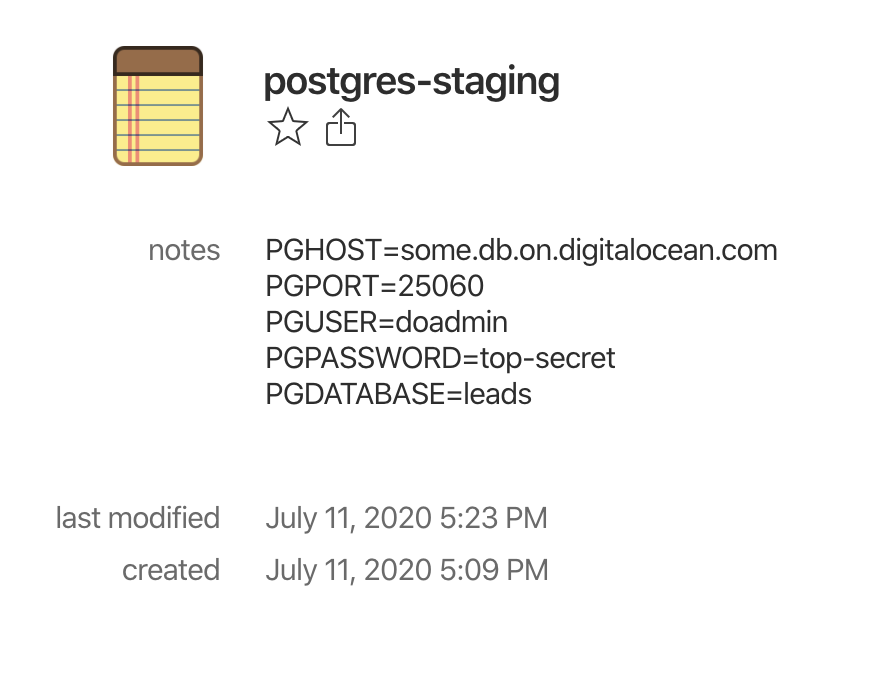

# openv 🔐

```
# before
PGHOST=some.hostname.com PGUSER=root PGPASSWORD=top-secret psql

# after
openv my-1password-secure-note -c psql
```

`openv` enables you to easily manage application environment variables in 1Password without
putting them plaintext on disk (e.g. into `.env`-files, `.zshrc`, `.bashrc`, ...).

This way you can continue using 1Password as a central secret storage and even
share certain environment configurations with your colleagues via 1Password shared vaults!

## Setup

1. __Installation__ \
     using Homebrew
    ```
    brew cask install 1password-cli
    brew tap tobiastrinks/openv
    brew install openv
    ```
    or using npm
    ```
    # requires installing the 1Password CLI manually: https://1password.com/de/downloads/command-line/
    npm install -g @ttrinks/openv
    ```

2. __1Password CLI Setup__ \
    `openv` uses the official 1Password CLI to access your vaults and set secrets. To authenticate
    checkout: https://support.1password.com/command-line-getting-started/
    ```
    op signin example.1password.com wendy_appleseed@example.com
    ```

3. __(Optional) enable auto-completion__ \
    Auto-completion helps you when selecting the secret from your 1Password CLI by name. (Only fully supported on MacOS)
    ```
   openv install-completion
   ```

## Usage

1. __create new `Secure Note` on 1Password__ \
    This content of the note must comply to the `.env` [RFC 2 specification](https://smartmob-rfc.readthedocs.io/en/latest/2-dotenv.html)
    

2. __start 1Password session__
    ```
    op signin
    ```

3. __Run your command with secret environment variables__
    ```
   openv postgres-staging -c psql
   ```

## Available options

```
Options
      --help          View manual
      --command, -c   The command you want to execute
      --env, -e       Manually overwrite values from 1Password note
```

## Security

As `openv` is able to read the secrets you store in the requested
`Secret Note` you should inspect the source code to ensure that you
trust the software.

## License (MIT)

Copyright 2020 Tobias Trinks

Permission is hereby granted, free of charge, to any person obtaining a copy of this software and associated documentation files (the "Software"), to deal in the Software without restriction, including without limitation the rights to use, copy, modify, merge, publish, distribute, sublicense, and/or sell copies of the Software, and to permit persons to whom the Software is furnished to do so, subject to the following conditions:

The above copyright notice and this permission notice shall be included in all copies or substantial portions of the Software.

THE SOFTWARE IS PROVIDED "AS IS", WITHOUT WARRANTY OF ANY KIND, EXPRESS OR IMPLIED, INCLUDING BUT NOT LIMITED TO THE WARRANTIES OF MERCHANTABILITY, FITNESS FOR A PARTICULAR PURPOSE AND NONINFRINGEMENT. IN NO EVENT SHALL THE AUTHORS OR COPYRIGHT HOLDERS BE LIABLE FOR ANY CLAIM, DAMAGES OR OTHER LIABILITY, WHETHER IN AN ACTION OF CONTRACT, TORT OR OTHERWISE, ARISING FROM, OUT OF OR IN CONNECTION WITH THE SOFTWARE OR THE USE OR OTHER DEALINGS IN THE SOFTWARE.
